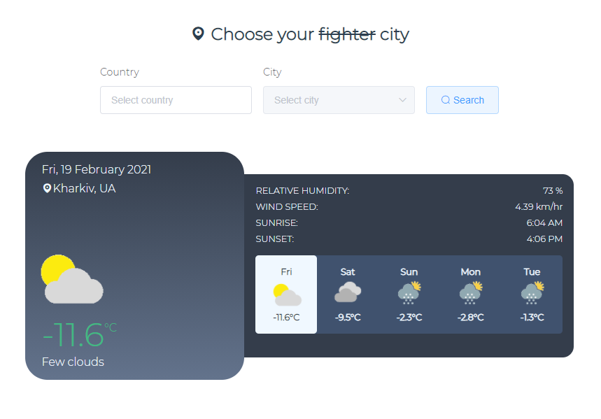

# ⛅️ Weather Forecast

## 📚 Project description

> 'Weather forecast' is a web application which provides weather forecast 
for the nearest 5 days. It uses geolocation API to retrieve user's latitude and longitude.
Also, there is opportunity to choose location from the form.
>



## ⚙️Project setup
```
npm install
```

### Compiles and hot-reloads for development
```
npm run serve
```

### Compiles and minifies for production
```
npm run build
```

### Run your unit tests
```
npm run test:unit
```

### Run your end-to-end tests
```
npm run test:e2e
```

### Lints and fixes files
```
npm run lint
```

### Customize configuration
See [Configuration Reference](https://cli.vuejs.org/config/).
